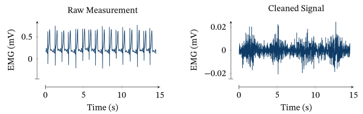

## Cardiac artifact removal toolbox

This software package provides Matlab implementations of a number of algorithms for removing cardiac interference from surface EMG measurements, as well as metrics and two exemplary datasets for evaluating their respective performance.

In particular, all algorithms desribed in the following two publications are included:
- E. Petersen, J. Sauer, J. Grasshoff, P. Rostalski, [Removing Cardiac Artifacts from Single-Channel Respiratory Electromyograms](https://ieeexplore.ieee.org/document/8988257), IEEE Access, 2020, and
- E. Petersen, [Model-based Probabilistic Inference for Monitoring Respiratory Effort using the Surface Electromyogram](https://e-pet.github.io/files/Dissertation%20Petersen.pdf), Dissertation, 2021.

In case of any questions, comments, or bugs, please don't hesitate to contact me or open an issue on GitHub.

The following picture shows an example of the problem to be solved here (and the solution provided by the PATS algorithm, see below):



#### Content
Two exemplary data sets of respiratory electromograms (two channels repectively) and simultanously measured airway pressure.
	
Matlab implementations of following algorithms:
- EMG Preprocessing
- QRS Detection (mostly taken from the [OSET toolbox](https://gitlab.com/rsameni/OSET) by [Reza Sameni](https://sameni.info/), with some minor modifications)
- Template Subtraction and Adaptive Template Subtraction
- Model-based ECG removal with second and 25th order Extended Kalman filter and smoother (based on Sameni et al., "A nonlinear Bayesian filtering framework for ECG denoising," 2007, IEEE Transactions on Biomedical Engineering, and Akhbari et al., "ECG denoising and fiducial point extraction using an extended Kalman filtering framework with linear and nonlinear phase observations," Physiological Measurement, 2016). Implementation partially based on the [OSET toolbox](https://gitlab.com/rsameni/OSET) of Reza Sameni.
- Wavelet Denoising (contributed by [Jan Graßhoff](https://www.ime.uni-luebeck.de/institute/staff/jan-grasshoff.html))
- Empirical Mode Decomposition
- Probabilistic Adaptive Template Subtraction (PATS, best-performing algorithm as per Petersen 2021).
		
Performance evaluation functions
- Signal-to-noise ratio
- Periodicity Measure
- Power spectral density
	
Analysis script: ecg_removal.m and functions to read, filter, plot and evaluate data

---

#### Run

    ecg_removal.m   
    
to read the provided data sets, apply ECG-removal algorithms (or reload precomputed results) and execute a performance evaluation.

The above script uses some additional machinery in order to handle multiple separate signals at the same time.

**If you just want to apply the algorithms to a single signal**, you can simply do something like the following:
```MATLAB
addpath('filters'); addpath('ecg_utils'); addpath('template_subtraction');
use_filtfilt = true;

% If you want a test signal to try this with, you can use the following; otherwise replace by your data
addpath('format_specific_utils');
if isempty(dir('../data/csv/subject1.csv'))
    if ~exist('../data/csv', 'dir')
        mkdir('../data/csv');
    end
    unzip('../data/subject1.zip','../data/csv')
end
rawData = load_measured_signals('../data/csv');
signal = rawData{1, 1};
fs = 1024; fpl = 50;  % fpl is powerline frequency (typically 50Hz or 60Hz)

% power line interference removal
signal = butter_filt_stabilized(signal, [fpl-1 fpl+1], fs, 'stop', use_filtfilt, 2);

% mild high-pass filtering (two versions, one for R peak detection and one for cardiac artifact removal) 
% to remove baseline wander and some ECG interference (especially in the 20Hz version)
signalhp05 = butter_filt_stabilized(signal, 5, fs, 'high', use_filtfilt, 6);
signalhp20 = butter_filt_stabilized(signal, 20, fs, 'high', use_filtfilt, 6);

% R peak detection, slightly modified version of Pan-Tompkins
rpeaks = peak_detection(signalhp05, fs);

% This is the actual cardiac artifact removal step
cleaned_ats = adaptive_template_subtraction(signalhp20, rpeaks, fs);
% Wavelet denoising is another very robust alternative
cleaned_swt = swtden(signal, rpeaks, fs, 'h', 3, 'db2', 4.5);
% Depending on the use case, even a simple HP100 might do
cleaned_hp100 = butter_filt_stabilized(signal, 100, fs, 'high', use_filtfilt, 6);

% for a simple comparison plot, consider using https://github.com/e-pet/plot_signals
% plot_signals([signal; cleaned_ats; cleaned_swt; cleaned_hp100], [], [], [], [], 'markers', rpeaks);
```

#### Notes on R Peak detection
Most of the algorithms rely - at least to some degree - on reasonably accurate R peak detection.
This is typically not a problem since cardiac artifacts are often much larger than EMG activity in respiratory surface EMG recordings (for which this toolbox was primarily developed).
In some cases, however, EMG activity may be higher or comparable in amplitude to the cardiac beats, which makes R peak detection hard or impossible in those regions.
For this reason, you should always check visually whether R peaks have been detected correctly. See the last line in the above code snippet for a simple way of doing so. (An automatic way of doing so would be desirable [but hasn't been implemented yet](https://github.com/ime-luebeck/ecg-removal/issues/2). Note however that min/max detected R peak intervals are reported on the command line, which should already serve as a good indicator.)

Some options if the R peak detection does not seem to work well:
- Assess whether this actually has a noticable effect on the quality of the denoised signals. In many cases, and if R peak detection still works for most of the signal, the denoising still works reasonably well.
- Use an algorithm that does not depend on R peak detection. Of the currently implemented algorithms, these are only the basic high-pass filters (which perform very well with a high cutoff frequency and are an attractive option for many applications!) and the EMD.
- Note that R peaks do *not* need to be detected in the channel to be denoised! If you are using multichannel measurements, and R peaks can be correctly and robustly detected in at least one of them, you can just use the result of that detection for removal in all channels. (Only the location/timing of the R peaks is passed to the algoroithms, *not* the R peak shape which will differ between channels.)

#### Acknowledgements
The toolbox contains code contributions by [Reza Sameni](https://sameni.info/) (Pan-Tompkins peak detection and some of the files in the `model-based` directory - see individual file headers -, all from the [OSET toolbox](https://gitlab.com/rsameni/OSET)), [Jan Graßhoff](https://www.ime.uni-luebeck.de/institute/staff/jan-grasshoff.html) (`swt_denoising`) and [Julia Sauer](https://www.ime.uni-luebeck.de/institute/staff/julia-sauer.html) (various files throughout the project).
Julia Sauer also performed the study from which the two included recordings have been obtained.
Everything else is authored by me (EP).

Most of the work leading to the development of this toolbox has been done while I was at the [University of Lübeck](https://www.uni-luebeck.de/en/university/university.html), with the [Institute for Electrical Engineering in Medicine](https://www.ime.uni-luebeck.de/institute.html).

--- 

Eike Petersen, 2021-2023
